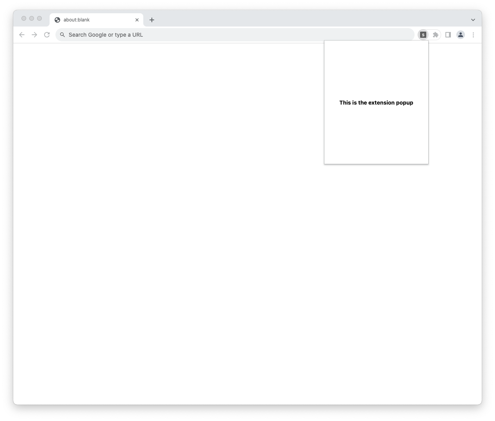

<h1 align="center">
        
</h1>

A javascript framework for building browser extensions. It takes away all the tedious configurations away from you and lowers the barrier to extension development.

### 🤷🏽‍♂️ How does it work?

**xtensio** provides you with a folder structure that comes with configurations already baked in. Hence, no configuration is needed to get started with your new extension project. Currently, it mainly supports React for development.

### 🚀 Creating a new Extension Project

To create a new extension project using xtensio, you can use the `create` command below which will then ask for your project name and

```bash
# npm
npx create-xtensio-app

# yarn
yarn create xtensio-app
```

OR

```bash
# npm
npx create-extension-app

# yarn
yarn create extension-app
```

### 🗂️ Folder Structure

Below is what the project structure with xtensio looks like and we'll be focusing on the folders.

<pre>
.
├── 📂 <a href="#📂-popup" style="color: inherit;text-decoration: underline">popup</a>
│   └── popup.tsx
├── 📂 <a href="#📂-contents" style="color: inherit;text-decoration: underline">contents</a>
│   ├── content_one.tsx
│   └── content_two.tsx
├── 📂 <a href="#📂-pages" style="color: inherit;text-decoration: underline">pages</a>
│   └── options.tsx
├── 📂 <a href="#📂-background" style="color: inherit;text-decoration: underline">background</a>
│   └── index.ts
├── manifest.ts
├── index.d.ts
└── tsconfig.json
</pre>

### 📂 Popup

Inside the popup folder is a file `popup.tsx` which exports a React component. This is the single entry point for your extension popup. The extension popup is the view that is rendered when you click on an extension icon. Just like seen in the image below.

<div align="center">
    
</div>

> In case your extension requires no popup then you can just delete or get rid of this file located at `/popup/popup.tsx`

### 📂 Contents

**The heart of extension development ❤️**

The primary goal of a browser extension is to change the user experience in the browser. This could mean changing the looks or adding some weird functionalities to websites rendered in the browser. All that great magic is handled in this contents directory.

**TODO**: Write about the contents file syntax

### 📂 Pages

Any file created in here is turned into an extension page. An extension page is a webpage that is hosted locally by your extension. This can be used to build stuff like the options or settings page for your extension.
These pages can be reached by using the utility function `visitPage` that comes with the xtensio package.

**Example**: If you create a file called `settings.tsx` in the pages directory that exports a react component, an extension page will be generated from that and you can navigate to that page using the code below.

```js
import { visitPage } from "xtensio";
...
const buttonClickHandler = () => {
    visitPage("settings"); // navigates to the settings.tsx page
}

return <button onClick={buttonClickHandler}>Visit Settings Page</button>
```

### 📂 Background

Inside the background folder is an `index.ts` file which serves as your single entry point for your extension's service worker or background script.

> You can freely create other files in the background directory and use them or import them into the `index.ts` file.

### 📜 Manifest.ts

This is the main file that handles most of the configurations related to a browser extension. It exports a JavaScript object as default which is used in generating the [manifest.json](https://developer.chrome.com/docs/extensions/mv3/manifest/) which is required when creating a browser extension.

Even tho this configuration can be extended, some parts of it may be overwritten by xtensio. Mainly the `content_scripts` `background` `action`.
