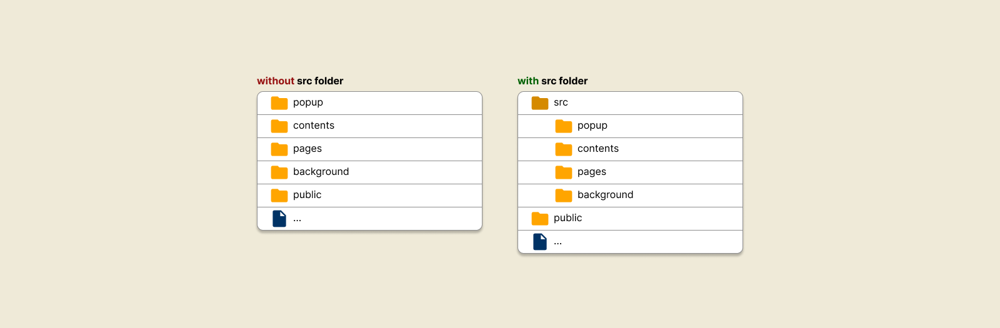

# Xtensio Project Structure

This page provides an overview of the project structure of an Xtensio application. It covers top-level folders, files and configuration files.

## Top level folders

| Folder name                                                      | Description                                                                           |
| ---------------------------------------------------------------- | ------------------------------------------------------------------------------------- |
| [:link:**`popup`**](guide/creating-an-extension-popup.md)        | This controls the view that is rendered when you click on an extension icon           |
| [:link:**`contents`**](guide/manipulating-a-website.md)          | Allows users to manipulate the content and functionality of a websites ❤️             |
| [:link:**`pages`**](guide/creating-extension-pages.md)           | This folder allows you to create webpages that are hosted within extension.           |
| [:link:**`background`**](guide/managing-background-processes.md) | In charge of heavy computations and also the use of most browser API's for extensions |
| [:link:**`public`**](#)                                          | For managing static assets like images, icons and others                              |
